# MediMind Architecture Diagram

## System Overview

MediMind is a comprehensive medical application with the following AWS infrastructure:

- **Database**: Amazon RDS (Relational Database Service)
- **Backend**: EC2 Instance
- **Frontend**: EC2 Instance
- **ML Services**: EC2 Instance
- **Mobile**: Android Application

## Architecture Diagram

```mermaid
graph TB
    %% External Users
    User[👤 End User]
    MobileUser[📱 Mobile User]

    %% AWS Cloud
    subgraph AWS["☁️ AWS Cloud"]
        subgraph VPC["🔒 VPC"]
            subgraph PublicSubnet["🌐 Public Subnet"]
                ALB[🔄 Application Load Balancer]

                subgraph EC2Instances["🖥️ EC2 Instances"]
                    FrontendEC2[💻 Frontend Server<br/>React/Next.js]
                    BackendEC2[⚙️ Backend Server<br/>Node.js/Python]
                    MLEC2[🤖 ML Server<br/>Python/TensorFlow]
                end
            end

            subgraph PrivateSubnet["🔐 Private Subnet"]
                RDS[(🗄️ Amazon RDS<br/>PostgreSQL/MySQL)]
            end
        end

        %% AWS Services
        S3[📦 Amazon S3<br/>Static Assets]
        CloudFront[🌍 CloudFront CDN]
    end

    %% External Services
    subgraph External["🌐 External Services"]
        API[🔌 External APIs<br/>Medical Data]
        MLModel[🧠 Pre-trained Models]
    end

    %% Connections
    User --> CloudFront
    MobileUser --> ALB
    CloudFront --> S3
    CloudFront --> FrontendEC2
    ALB --> FrontendEC2
    ALB --> BackendEC2
    ALB --> MLEC2

    FrontendEC2 --> BackendEC2
    BackendEC2 --> RDS
    BackendEC2 --> MLEC2
    MLEC2 --> RDS

    BackendEC2 --> S3
    MLEC2 --> S3
    MLEC2 --> External
    BackendEC2 --> API

    %% Styling
    classDef aws fill:#FF9900,stroke:#232F3E,stroke-width:2px,color:#fff
    classDef ec2 fill:#FF6B35,stroke:#232F3E,stroke-width:2px,color:#fff
    classDef rds fill:#0073BB,stroke:#232F3E,stroke-width:2px,color:#fff
    classDef user fill:#4CAF50,stroke:#2E7D32,stroke-width:2px,color:#fff
    classDef external fill:#9C27B0,stroke:#6A1B9A,stroke-width:2px,color:#fff

    class AWS,VPC,PublicSubnet,PrivateSubnet aws
    class FrontendEC2,BackendEC2,MLEC2 ec2
    class RDS rds
    class User,MobileUser user
    class External,API,MLModel external
```

## Component Details

### 🗄️ Database Layer (Amazon RDS)

- **Service**: Amazon RDS
- **Database**: PostgreSQL/MySQL
- **Purpose**: Store user data, medical records, ML model results
- **Security**: Private subnet, encrypted at rest

### ⚙️ Backend Server (EC2)

- **Location**: Public subnet
- **Technology**: Node.js/Python
- **Responsibilities**:
  - API endpoints
  - Business logic
  - Database operations
  - Authentication/Authorization
  - Integration with ML services

### 💻 Frontend Server (EC2)

- **Location**: Public subnet
- **Technology**: React/Next.js
- **Responsibilities**:
  - User interface
  - Client-side logic
  - API consumption
  - Static asset serving

### 🤖 ML Server (EC2)

- **Location**: Public subnet
- **Technology**: Python/TensorFlow/PyTorch
- **Responsibilities**:
  - Model inference
  - Data preprocessing
  - Model training (if needed)
  - Medical image analysis
  - Predictive analytics

### 📱 Mobile Application

- **Platform**: Android
- **Technology**: Native Android/Kotlin
- **Responsibilities**:
  - Mobile user interface
  - Offline capabilities
  - Push notifications
  - Camera integration for medical images

### 🔄 Load Balancer

- **Service**: Application Load Balancer
- **Purpose**: Distribute traffic across EC2 instances
- **Health checks**: Monitor instance health
- **SSL termination**: Handle HTTPS traffic

### 📦 Storage (S3)

- **Service**: Amazon S3
- **Purpose**: Store static assets, medical images, ML models
- **CDN**: CloudFront for global content delivery

## Security Considerations

- **VPC**: Isolated network environment
- **Security Groups**: Control inbound/outbound traffic
- **IAM**: Role-based access control
- **Encryption**: Data encrypted in transit and at rest
- **Private Subnet**: Database isolated from public internet

## Scalability Features

- **Auto Scaling**: EC2 instances can scale based on demand
- **Load Balancing**: Distribute traffic across multiple instances
- **CDN**: Global content delivery for better performance
- **RDS**: Managed database with automatic backups and scaling

## Monitoring & Logging

- **CloudWatch**: Monitor EC2 instances, RDS, and application metrics
- **CloudTrail**: Audit API calls and user activity
- **Application Logs**: Centralized logging for debugging and monitoring
